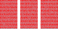

# BOXES v0.5

In our [previous lesson](lesson4.run.html) we created code that can fill a
series of pages using many small boxes.

But only when those boxes are all alike. Once the boxes had different widths,
the right side of our layout got all ragged. You surely have seen things like
it when using word processors or reading web pages, where the text is all
aligned on the left and all ragged on the right. It's called a "left-aligned"
or "ragged-right" layout.

The reason is that we exceed the page width by a random amount, and then, when
moving that box to the next row, we are left a random amount **short** of the
desired width.

Could we make it look aligned on BOTH sides? Of course. Let's try.

This code is just like before:

```python-include:code/lesson5.py:1:20
```

And of course, we need a new layout function. The plan is this:

* Organize boxes in rows, like before.
* When we are about to go too wide, see how much "slack" is left between the
  right side of our last box in the row and the edge of the page.
* Spread that slack by sliding all boxes slightly right so nobody notices.

```python-include:code/lesson5.py:22:72
```

The drawing code needs no changes.

```python-include:code/lesson5.py:75
```



Isn't that nice? If you look at it from afar it looks sort of familiar.
Doesn't it?

----------

Further references:

* Full source code for this lesson [lesson5.py](lesson5.py.run.html)
* [Difference with code from last lesson](code/diffs/lesson4_lesson5.html)
